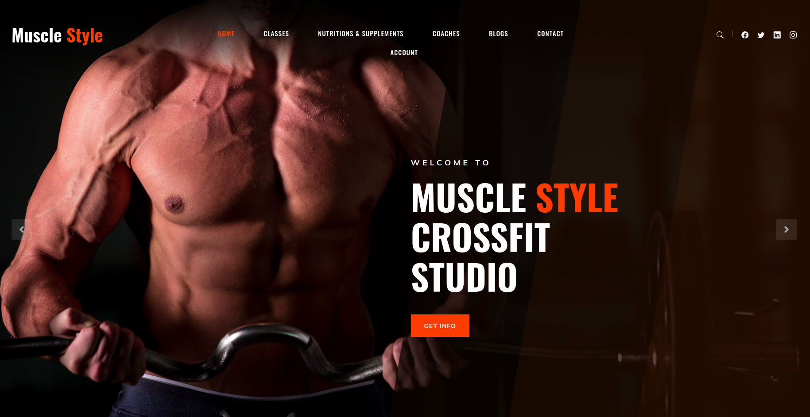
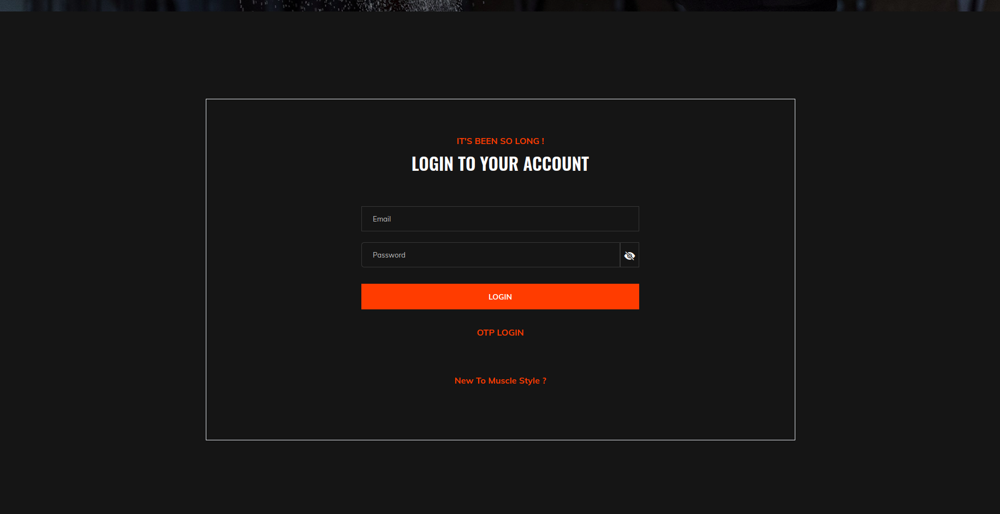
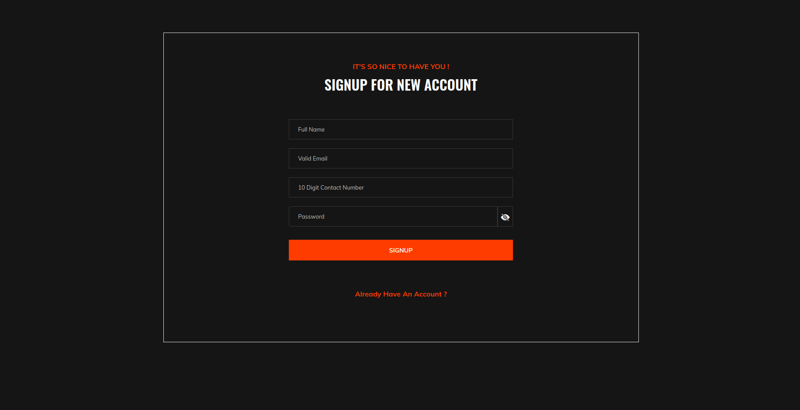
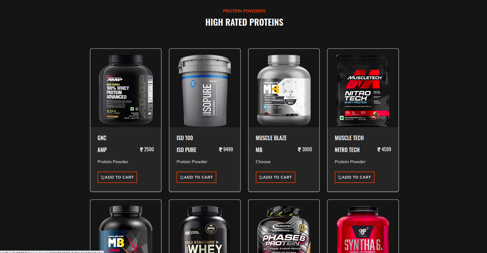
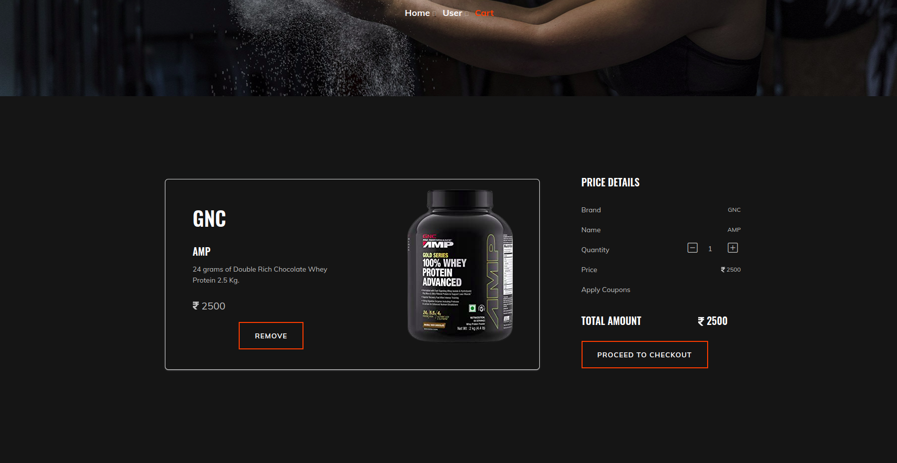
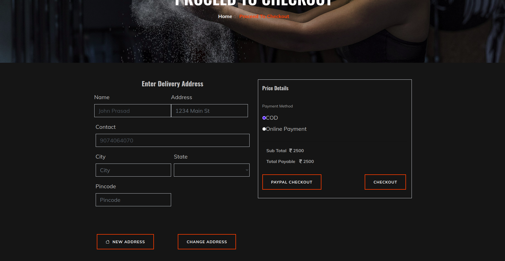

# MUSCLE_STYLE - Premium eCommerce Fitness Store

MUSCLE_STYLE is a robust, full-stack eCommerce application built from scratch, designed to provide a seamless shopping experience for fitness enthusiasts. From high-quality protein supplements to workout gear, this platform handles everything from user authentication to complex order management.

> [!IMPORTANT]
> **Project Status:** This website is currently **under development**. 
> Please note that **PayPal** and **Razorpay** payment gateways are currently undergoing maintenance and are not fully functional. These will be fixed and activated in the upcoming updates once credentials are fully configured.

---

## 📸 Screenshots

| Home Page | Login Page |
|-----------|------------|
|  |  |

| Sign Up Page | Products Page |
|--------------|---------------|
|  |  |

| Cart Page | Checkout Address |
|-----------|------------------|
|  |  |

---

## 🚀 Key Features

### 🛒 Seamless Shopping Experience
- **Smart Cart Persistence:** Your items stay in your cart even if a payment fails or is cancelled, ensuring you never lose your progress.
- **Hybrid Image Loading:** Powered by **Cloudinary**, ensuring lightning-fast image delivery with local fallbacks for maximum reliability.
- **Dynamic Pricing:** Real-time calculation of totals, discounts, and coupon applications.

### 🔐 Secure & User-Friendly
- **OTP Authentication:** Secure Login and Signup using Twilio-powered OTP verification.
- **Robust Payment Logic:** Built-in safeguards to prevent crashes and provide clear guidance when payment methods are offline.
- **Profile Management:** Track your orders, view cancelled items, and manage multiple delivery addresses.

### 🛠 Powerful Admin Dashboard
- **Comprehensive User Management:** Monitor user status, block/unblock accounts, and view order histories.
- **Product & Category Control:** Full CRUD operations for seamless inventory management.
- **Sales Intelligence:** Detailed sales reports (daily, weekly, monthly, and yearly) to track business growth.
- **Promotional Tools:** Easy-to-use interface for creating coupons and managing product offers.

---

## 🛠 Technologies Used

- **Backend:** Node.js, Express.js
- **Database:** MongoDB (NoSQL) with Atlas Cloud support
- **Storage:** Cloudinary (Cloud-based Image Management)
- **Frontend:** Handlebars (HBS), Bootstrap 5, Vanilla CSS
- **Authentication:** Twilio Verify API
- **Payments:** Razorpay & PayPal REST SDKs (Integrated & Pending Activation)
- **Environment:** Dotenv for secure configuration

---

## 📋 Prerequisites

Before you begin, ensure you have the following installed:
- [Node.js](https://nodejs.org/) (v14.x or higher)
- [npm](https://www.npmjs.com/)
- [MongoDB](https://www.mongodb.com/) (local or Atlas)

---

## ⚙️ Getting Started

### 1. Clone the Repository
```bash
git clone https://github.com/AlenGeoCalistus/Muscle_Style.git
cd Muscle_Style
```

### 2. Install Dependencies
```bash
npm install
```

### 3. Environment Configuration
Create a `.env` file in the root directory and add your credentials:
```env
PORT=3000
MONGO_URI=your_mongodb_uri

# Cloudinary Credentials
CLOUDINARY_CLOUD_NAME=your_cloud_name
CLOUDINARY_API_KEY=your_api_key
CLOUDINARY_API_SECRET=your_api_secret

# Twilio Credentials
TWILIO_ACCOUNT_SID=your_sid
TWILIO_AUTH_TOKEN=your_token
TWILIO_VERIFY_SERVICE_SID=your_service_sid

# Payment Gateways (Ready for activation)
RAZORPAY_KEY_ID=your_razorpay_key
RAZORPAY_KEY_SECRET=your_razorpay_secret
PAYPAL_CLIENT_ID=your_paypal_id
PAYPAL_CLIENT_SECRET=your_paypal_secret
```

### 4. Run the Application
```bash
# For development (auto-restart)
npm start

# For production
node ./bin/www
```

The application will be available at `http://localhost:3000`.

---

## 🚧 Roadmap
- [ ] Stabilize and activate PayPal/Razorpay in production.
- [ ] Migrate session storage to `connect-mongo` for better scalability.
- [ ] Implement advanced product search and filtering.
- [ ] Enhance mobile responsiveness and UI animations.

---
*Created with ❤️ by Alen Geo Calistus*
